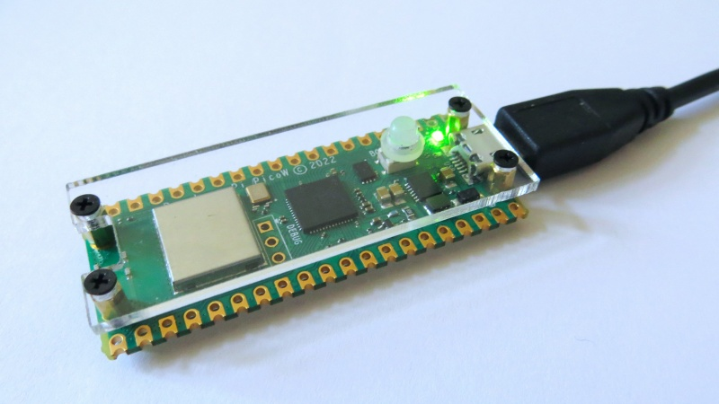

# The PicoWifi

**An inexpensive and easy-to-use Wifi dongle for Ataris with USB** – such as the [Lightning VME](https://wiki.newtosworld.de/index.php?title=Lightning_VME_En)/[ST](https://wiki.newtosworld.de/index.php?title=Lightning_ST) cards. Based on the [Raspberry Pi Pico W](https://www.raspberrypi.com/news/taking-it-to-the-wireless-with-raspberry-pi-pico-w/)[^1].

Available software: uIP tool for easy file transfer, drivers for STinG and FreeMiNT.



## License terms and notice to people buying/selling hardware

PicoWifi is licensed under the [GNU General Public License, Version 3](https://www.gnu.org/licenses/gpl-3.0-standalone.html) (GPLv3).

There is no official supplier of pre-programmed PicoWifi hardware, but people are free to sell such hardware, *as long as they adhere to the license terms!* Please see the included `COPYING` file for the full and legally binding license terms. But in layman's terms you have the following rights and obligations:

- You may sell hardware with pre-programmed PicoWifi firmware.
- You may modify the PicoWifi firmware and redistribute a modified version. However, such modifications must also be licensed under the same terms. Among other things you must add a notice that you modified it and you must make the modified source code available.
- As a seller you must make the license terms clear to the buyer and offer them access to the source code that corresponds to the binary you redistribute (also pre-installed on hardware). As a buyer you have the right to demand this source code.
- For binaries built from the original source, a link to this repository is sufficient. If you redistribute binaries with your modifications, you have to ensure adequate access to the source code yourself.

## System requirements

- A USB interface in your Atari, e.g., the [Lightning VME](https://wiki.newtosworld.de/index.php?title=Lightning_VME_En), [Lightning ST](https://wiki.newtosworld.de/index.php?title=Lightning_ST), or NetUSBee.
- A Raspberry Pi Pico W[^1], preferably obtained from an [authorized reseller](https://www.raspberrypi.com/products/raspberry-pi-pico/#find-reseller) for about 6 USD / 7 €.
  Note: Select *Wireless = yes* from the page above and make sure you buy a Pico **W** (= with Wifi). A Raspberry Pi Pico (without W) cannot be used.
- No other hardware except for a suitable USB cable (Micro USB B) is needed.

## Firmware installation and upgrade

- Hold down the _BOOTSEL_ button on the Raspberry Pi Pico W while connecting it to a computer.
- The Raspberry Pi Pico W will appear as a USB mass storage device – like a USB stick.
- Copy the `picowifi.uf2` [firmware file](https://github.com/czietz/picowifi/releases/tag/latest) onto this USB mass storage device.
- The Raspberry Pi Pico W will automatically reboot and appear as a new USB device named _PicoWifi_. You can verify this in the Device Manager under Windows, with the `lsusb -v` command under Linux, or with `ioreg -p IOUSB` on macOS.
- Repeat these steps whenever you want to upgrade the firmware to a newer version.

## USB driver requirements on the Atari

PicoWifi makes use of the existing USB software stack for TOS and MiNT maintained by the FreeMiNT project. The [USB drivers for TOS](https://freemint.github.io/#snapshots) are available as a separate package, whereas the drivers for MiNT are included in the [FreeMiNT snapshots](https://freemint.github.io/#snapshots).

You need at least the following drivers for PicoWifi:

- For TOS: `USB.PRG`, the driver for your USB adapter (e.g., `BLITZ*.PRG` or `NETUSBEE.PRG`), and the helper accessory `USBTOOL.ACC`.
- For MiNT: `usb.km`, the driver for your USB adapter (e.g., `blitz*.ucd` or `netusbee.ucd`), and `eth.udd`. These drivers need to be loaded by `loader.prg` which is also included in the FreeMiNT snapshots.

It is highly recommended to always use the latest drivers, as they might fix some important bugs. In particular, before reporting an issue with PicoWifi, please check if that issue is still present with the latest USB drivers.

Please refer to the documentation of your USB adapter for further details about the drivers and their installation and configuration.

## Configuring your Wifi access credentials

### Storing the credentials on the Atari

Create a text file `C:\WIFICRED.CFG` (or `A:\WIFICRED.CFG` if your Atari just has a floppy drive but no hard disk). Put into this file:

- In the *first* line: The SSID (name) of your Wifi network.
- In the *second* line: The password for your Wifi network.

Do not put anything else (comments, empty lines, …) into the file.

The PicoWifi supports WPA and WPA2 encryption.

Note: The FreeMiNT driver will also search for `/etc/wificred.cfg` if the files mentioned above do not exist.

### Storing the credentials on the PicoWifi

Alternatively, the SSID and password can be stored in the flash memory on the PicoWifi. The Python[^2] script `wificred-store.py` will ask for your Wifi credentials and store them into a file `wificred.uf2` in the current directory. `wificred.uf2` then needs to be written to the Raspberry Pi Pico W in the same way as the firmware: connect while holding the _BOOTSEL_ button, then copy file.

Afterwards, `WIFICRED.CFG` on the Atari is no longer used, as the credentials stored on the PicoWifi take precedence.

The stored Wifi credentials are _not_ overwritten by a firmware update. In case you want to delete them again, copy the `wificred-delete.uf2` file to the Raspberry Pi Pico W.

## Using PicoWifi with the uIP-Tool

A version of the uIP-Tool adapted for the PicoWifi offers a straight-forward way of exchanging files between your Atari and another computer: Get `uip-usb-master.tos` from [here](https://bitbucket.org/czietz/uip-tools/downloads/) (and rename it to `UIP.TOS`).

On the Atari start `UIP.TOS` and wait until the PicoWifi has established its Wifi connection. The LED on the PicoWifi indicates a successful connection. If your network router automatically assigns IP addresses, you will then be shown the IP address under which you can connect to your Atari from another computer using a web browser (HTTP) or an FTP client.

uIP-Tool can be terminated by pressing (almost) any key; for example, _Space_ or _Esc_. Don’t exit it by pressing _Ctrl+C_, as this can leave the USB stack in an inconsistent state.

Please refer to the [uIP-Tool documentation](https://bitbucket.org/sqward/uip-tools/src/master/README.md) for further explanation, in particular if you need to manually configure an IP address.

Troubleshooting:

- Using `USBTOOL.ACC` (from the Desktop menu: Desk – USB Utility) check that the PicoWifi is recognized as a USB device. If not, try replacing the cable.
- If the PicoWifi is listed as a USB device but uIP-Tool still fails to connect to your Wifi network, you can get status information by pressing the _F2_ key within the uIP-Tool. Pay particular attention to the _Wifi status_ line. (Note: If the password is wrong, the status might toggle between _Connected_ and _Authentication failed_ when you repeatedly press *F2*).
- By pressing the _F2_ key within the uIP-Tool you will also be shown the Received Signal Strength Indicator (RSSI). Values of -40 dB to -50 dB are very good. -60 dB is okay, -80 dB indicates a borderline weak connection.
- If you experience instability, e.g., sudden loss of connection or aborted transfers, even though the RSSI is good, try a different cable. Some cables cannot properly supply the peak current when the PicoWifi is transmitting[^3].

Note: The USB version of the uIP-Tool also supports the Asix USB-to-Ethernet adapter. You can only connect _one_ device at a time: either the PicoWifi or the Asix adapter.

## Using the PicoWifi with STinG

STinG is a popular IP network stack for TOS, providing Internet access to applications such as the [FTP client Litchi](https://ptonthat.fr/litchi/) or the web browser CAB. To use STinG with the PicoWifi, copy the [STinG driver for the PicoWifi](https://github.com/czietz/usbsting) (`USB_NET.STX`) into the `STING` folder. Make sure to load `STING.PRG` *after* the USB drivers in the `AUTO` folder.

Configure STinG as indicated in its documentation. As a quick reminder, the following settings are required:

- In the _STinG Port Setup_ CPX, select and activate the hardware – called *USBether* – and assign it an IP address within your home network and the appropriate subnet mask. (STinG does not support automatically getting an IP address via DHCP.)
- In the _STinG Protocols_ CPX under _Resolver_ assign a DNS server, most likely your home router.
- Edit the `STING\ROUTE.TAB` file with a text editor to define routes to your home network and a default route using your home router as a gateway.
- Furthermore, for best network performance, I recommend reducing the _Delay_ value in the _STinG Internals_ CPX to 10 on faster computers (e.g., Atari TT).

Again, the LED on the PicoWifi indicates a successful connection.

Note: It is recommended to update STinG’s TCP driver `TCP.STX` by an [updated version](https://www.chzsoft.de/storage/TCP.STX) that fixes a compatibility issue when connecting to some hosts.

Note: The USB STinG driver also supports the Asix USB-to-Ethernet adapter. You can only connect _one_ device at a time: either the PicoWifi or the Asix adapter.

## Using the PicoWifi with MiNTNet

A PicoWifi driver is available for FreeMiNT and included in the [FreeMiNT snapshot builds](https://freemint.github.io/#snapshots). When updating an existing MiNT installation, copy `picowifi.xif` into the folder of your MiNT installation which contains the other `.xif` files. Don’t forget to load the MiNT USB stack – see above.

The PicoWifi network interface is called `pwi0` and can be configured like any other network interface in MiNT. The following steps describe a minimal setup:

- Run `ifconfig pwi0 addr x.x.x.x up`, replacing *x.x.x.x* by the IP address you want to assign to the PicoWifi.
- Run `route add default pwi0 gw y.y.y.y`, replacing *y.y.y.y* by the IP address of the gateway, i.e., your home router.
- Both commands can be added to your `mint.cnf` _after_ the line executing the USB `loader.prg`.
- Edit `/etc/resolv.conf` (or `resolv.con` in case of an 8+3 file system) to contain the line `nameserver z.z.z.z`, replacing *z.z.z.z* by the IP address of a DNS server, most likely your home router.

Again, the LED on the PicoWifi indicates a successful connection.

## Support

The PicoWifi firmware and accompanying software are offered free of charge and – as stated in the license terms – “as is” without warranty of any kind.

Still, please feel free to report issues using [GitHub’s issue tracker](https://github.com/czietz/picowifi/issues). However, before reporting an issue with PicoWifi, please check if that issue is still present with the latest USB drivers and the latest PicoWifi firmware. Remember that you can check the firmware version by pressing _F2_ in the uIP-Tool.

## Building from source

In case you don’t want to use the [pre-built binaries](https://github.com/czietz/picowifi/releases/tag/latest), you can build the PicoWifi firmware from the source code in this repository. The [Getting started with Raspberry Pi Pico](https://datasheets.raspberrypi.com/pico/getting-started-with-pico.pdf) guide explains how to install the SDK and toolchain for the Raspberry Pi Pico and how to use `cmake` and `make` to build software.

There is one caveat: The current (v.1.4.0) Raspberry Pi Pico SDK does not allow building with only low-level Wifi support (i.e., without including lwIP). Therefore, you have to use the following fork of the SDK instead of the official SDK described in the _Getting started_ guide.

```
git clone -b without_lwip https://github.com/czietz/pico-sdk.git
```

[^1]: Despite the name similarity, the Raspberry Pi Pico is not to be confused with the Raspberry Pi Zero, 1, 2, 3, 4. While the latter are single-board computers running Linux, the Raspberry Pi Pico is a board based on the much smaller RP2040 ARM Cortex M0+ _microcontroller_. The PicoWifi project does not support the Linux-based Raspberry Pi Zero, 1, 2, 3, 4, and will not be ported to them.

[^2]: Windows users might have to [install Python](https://www.python.org/downloads/) first.

[^3]: Even though the peak supply current (about 300 mA) is well within the allowed range for USB 1.1/2.0 devices.